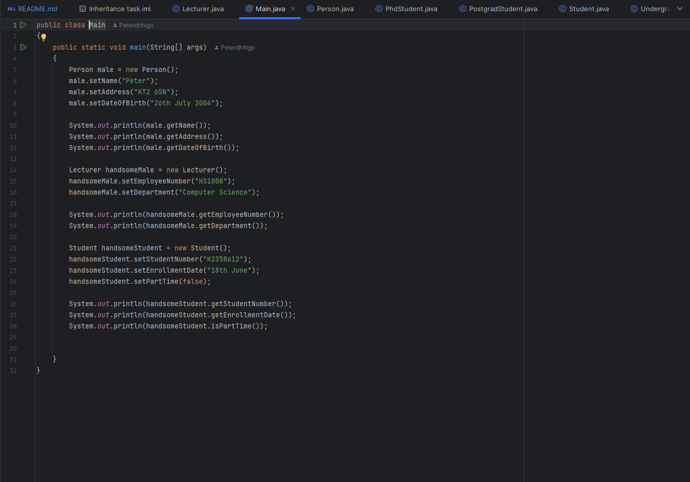
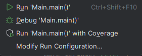

# Simple Inheritance focused task
# Overview
+ Showcase the understanding of inheritance in java language
+ Create an Object Oriented model to match the description of the UML below:

### Prerequisites
+ Git needs to be installed on your computer.
    - You can download Git from https://git-scm.com/downloads and install it.
+ JDK 11 or higher.

### Setup and Installation
#### Use terminal or command prompt and execute the following steps:
1. Move to the folder which you would like the code to be stored.
2. Open Git Bash
3. Clone the repository:
- Use **git clone (repository-url)** to clone this repository to your local machine.
4. Use your preferred coding mechanic and open the file that has just been pulled by git bash.

### Running the Applications
+ Visit each class once

+ Run the Java file directly from the main class

### Contributing
Contributions to further enhance the code, additions of new applicable features are welcome. Please fork the repository, apply your changes and submit a pull request with a detailed description of your improvements.